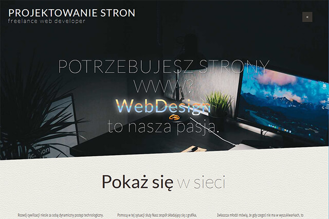

# Web page Freelancer Frontend Developer

## The site has been updated in order to learn about other known technologies and improve acquired skills.
 * HTML
 
 * CSS

 * SASS
 
 * BEM
 
 * GULP
 
 * JavaScript
 
 * JQuery
 
 * GitHub
 
## Screenshots

 [DEMO](http://www.web-service.com.pl/)
 
 
  
## After completing the setting of dependencies, we start the project with the command (required npm)
 * npm install
   
## When the dependency dependence process finishes, we start the project with the command
 * gulp
   
## Contact
 Created by [@pablop76](http://www.web-service.com.pl/) - feel free to contact me!
  

 
